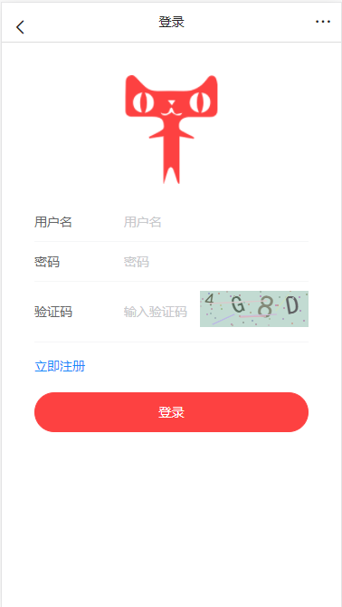
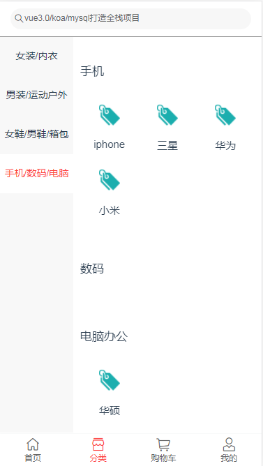
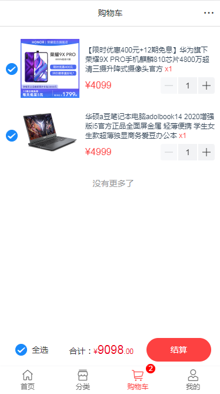
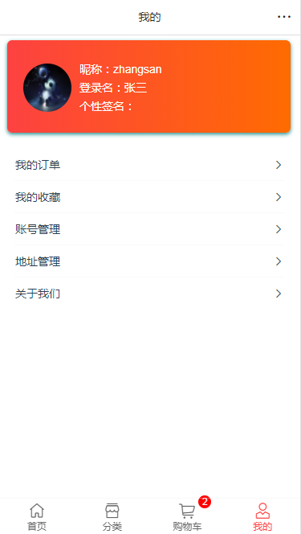
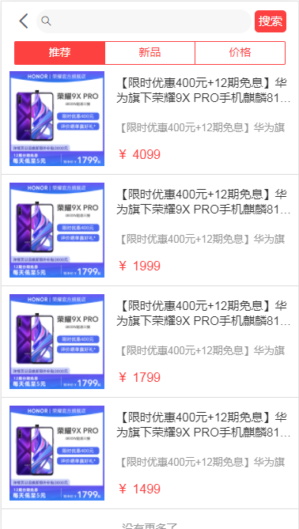
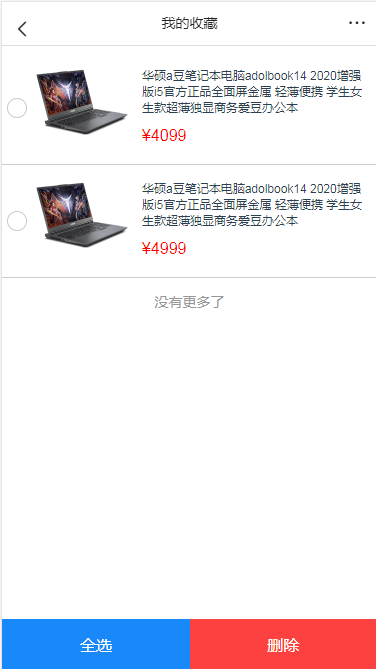
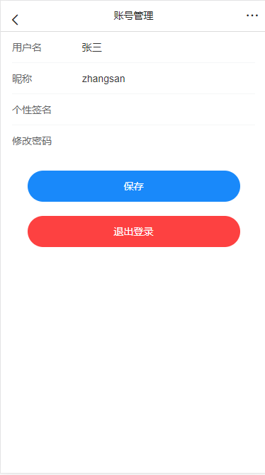
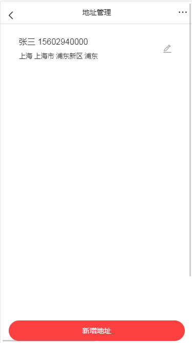

# mall-vue3

## 参考开源

## https://github.com/newbee-ltd/newbee-mall-vue3-app

## 在线api文档:

## http://47.100.138.242:8085/apidom/frontend/index.html

## 


项目展示






















## Project setup

```
npm install
```

### Compiles and hot-reloads for development

```
npm run serve
```

### Compiles and minifies for production

```
npm run build
```

### Lints and fixes files

```
npm run lint
```

### Customize configuration

See [Configuration Reference](https://cli.vuejs.org/config/).